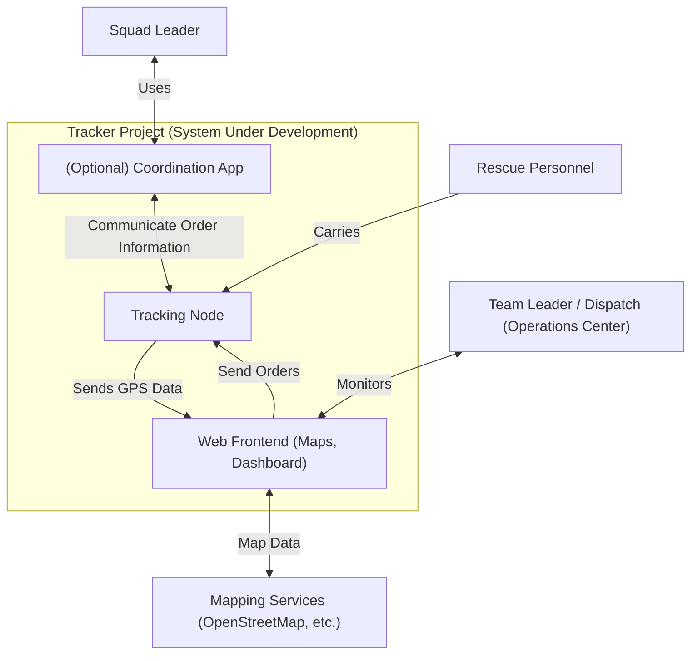

# Real-Time Tracking of Rescue Forces in Blackout or Mobile Overload Scenarios

> **_Warning!_**  This Content is Work in Progress. And nowhere near Complete yet.
> its just to give a glimpse at the current state of the Project.

> **_Info:_**  This is based on the [ARC 42 Template](https://arc42.org/)

## Overview
The goal of this project is to design a system for real-time tracking of rescue forces during emergency situations where communication infrastructure may be compromised. This system should provide a live situation view and optional communication capabilities for group leaders.

It should provide but not be Limited to the Following Use Cases:
- **Coordination of Rescue Forces**: The tool should facilitate the coordination of rescue efforts via a Situation Map, ensuring that all teams are working together efficiently.
- **Visualization of Searched Areas**: Visualize areas that have been searched to easily identify where personnel may be missing or where searches have not been conducted.

## Quality Goals
1. **Independent** It should be functional without external Infastrukture.
2. **Easy too Use**, everything should be Easy too use and Self Explanatory. Be it for Leaders or for Rescue Forces on the Ground.
3. **Fast to Deploy** should be Deployable in Minutes or Seconds

## Architecture Constraints

The second-generation GPS tracker system for the DLRG is developed under the following constraints:

## 2.1 Organizational Constraints

    Volunteer collaboration: Developing, Assembly and testing should be supportable by volunteer members for now, requiring a design that is simple to assemble and maintain.

    Incremental rollout: System will be field-tested in smaller events before full-scale deployment.

## 2.2 Technical Constraints

    Self-sufficient operation: Trackers must be fully functional without reliance on external infrastructure such as cellular networks or internet connectivity in the field.

    Waterproof and rugged: Housing must be suitable for extended exposure to water, sunlight, and temperature fluctuations; improved sealing compared to first prototype.

    Reliable positioning: GPS modules must meet defined accuracy thresholds to ensure operational usefulness.

    LoRa mesh networking: Continued use of the Meshtastic protocol over LoRa for peer-to-peer and relay-based GPS data transmission.

    Easy field servicing: Components should be replaceable or repairable without specialized tools.

    Data integration: Live location data must be transformed into a situation map, for which the same Requirments as liste above applie.

## 2.3 Regulatory & Safety Constraints

    Radio regulations: Must comply with German frequency allocation and transmission power rules for LoRa devices.

    Data protection: GPS data handling should comply with GDPR when possible; tracking is only for operational safety and not retained for personal profiling.

    Electrical safety: The System must meet safety standards for use in wet environments, with appropriate Protections.

## 3. Scope and Context
### 3.1 Business Context

The DLRG (Deutsche Lebens-Rettungs-Gesellschaft) regularly operates in environments where quick and precise coordination of rescue forces is crucial — such as during search-and-rescue operations or large-scale water events, and public safety deployments.
One of those challenging events is "Nabada" in Ulm, the largest water parade in southern Germany, attracting thousands of participants and visitors along the Danube. Ensuring safety in such an environment requires knowing the positions of rescue units in real time. The same is true in Big Scale Flooding Rescue Operations.

The GPS tracker system aims to:

    Provide real-time location awareness for all operational units.

    Improve coordination efficiency in complex environments.

    Increase operational safety by quickly identifying the nearest available rescue resources.

    Reduce dependence on external communication infrastructure.

Primary stakeholders:

    DLRG operational leadership — uses live location data for coordination and decision-making.

    Rescue personnel — carry GPS trackers during operations.

    Developer - Develops the Application and Hardware

Out of scope:

    Long-term historical data storage for movement analysis.

    Integration with unrelated DLRG systems (e.g., training databases).

### 3.2 Technical Context

#### 3.2.1 System Overview

The system is based on Meshtastic LoRa mesh devices, connected optionally to mobile apps and a central backend.

Field Devices (LoRa nodes): Meshtastic-compatible devices carried by volunteers. They send/receive GPS data and short messages.

Mobile Apps (Android/iOS): Provide UI for volunteers to view maps, locations, and send messages.

Gateway Nodes: Special devices that bridge the LoRa mesh to the internet when available.

Backend / Server: Collects, stores, and visualizes location data. Provides dashboards and integration with other systems (e.g., rescue coordination tools).

Web Frontend: Displays live maps and device status for team leaders.

#### 3.2.2 External Interfaces

The system components communicate through the following interfaces:

##### Android Services
The Navigation App interacts with the Meshtastic App on Android/iOS devices.
Provides services such as map display, Information sharing, and message forwarding.

##### Bluetooth
The Meshtastic App connects to Field Nodes (Meshtastic Devices) via Bluetooth Low Energy (BLE).
Used for configuration and data exchange. This is Handled by the Meshtastic Firmware.

##### LoRaWAN
Field Nodes form a peer-to-peer mesh network using LoRa radio technology.
Enables long-range, low-bandwidth communication between devices and Gateway Nodes.
This is Handled by Meshtastic.

##### MQTT
Gateway Nodes forward messages to the Backend Server via MQTT.
Provides lightweight, publish/subscribe messaging for device telemetry and location data.
The MQTT Publish is handled by the Meshtastic Firmware.

##### API
The Backend Server exposes APIs consumed by the Web Frontend
Supports live maps.

### 3.3 Context Diagramm

## 4. Solution Strategy

### Iterative Prototyping

- Prototyping Nahbaden

## 5. Building Block View

´´´mermaid
flowchart TD

    subgraph Tracker_Project["Tracker Project"]
        NAVAPP["Navigation App (Web/Android/iOS)"]
        APP["Meshtastic App (Android/iOS)"]
        FN["Field Nodes (Meshtastic Devices)"]
        GW[Gateway Node]
        BE[Backend Server]
        FE[Web Frontend]
    end

    NAVAPP <-- Service --> APP
    APP <-- Bluetooth --> FN
    FN <-- LoRaWan --> FN
    FN <-- LoRaWan --> GW
    GW <-- MQTT --> BE
    BE <-- API --> FE

´´´

## 10. QUality Requirments

### 10.1 Quality Tree

### 10.2 Quality Scenarios
