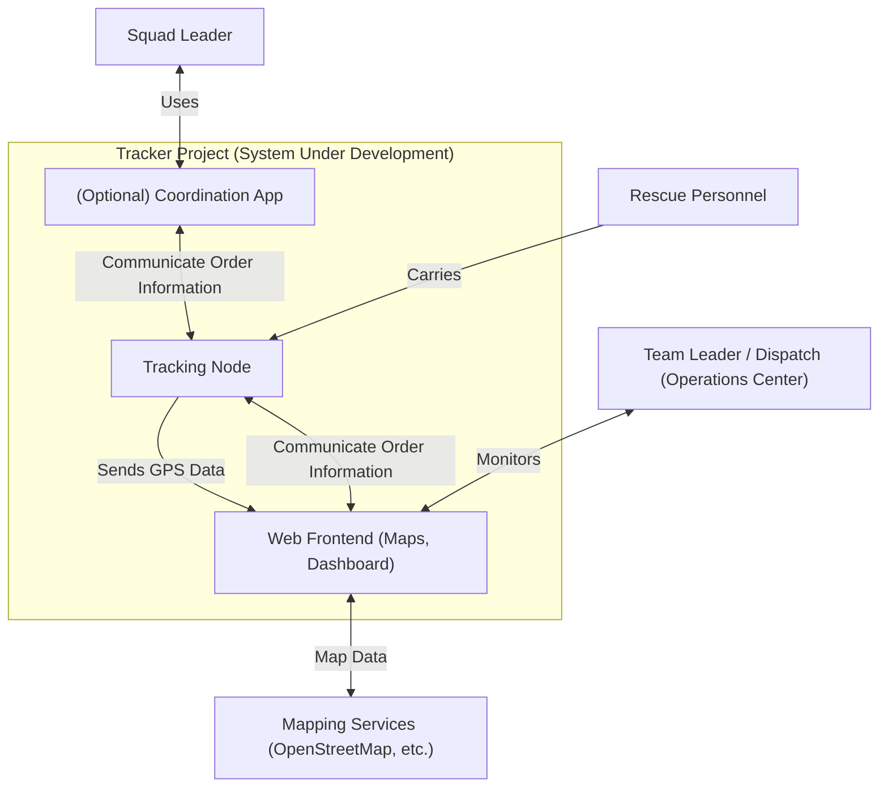
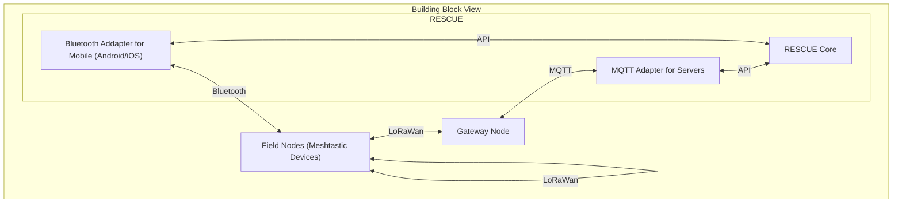

# Real-Time Tracking of Rescue Forces in Blackout or Mobile Overload Scenarios

> **_Warning!_**  This Content is Work in Progress. And nowhere near Complete yet.
> its just to give a glimpse at the current state of the Project.

> **_Info:_**  This is based on the [ARC 42 Template](https://arc42.org/)

## Overview
The goal of this project is to design a system for real-time tracking of rescue forces during emergency situations where communication infrastructure may be compromised. This system should provide a live situation view and optional communication capabilities for group leaders.

It should provide but not be Limited to the Following Use Cases:
- **Coordination of Rescue Forces**: The tool should facilitate the coordination of rescue efforts via a Situation Map, ensuring that all teams are working together efficiently.
- **Visualization of Searched Areas**: Visualize areas that have been searched to easily identify where personnel may be missing or where searches have not been conducted.

## Quality Goals
1. **Independent** It should be functional without external Infrastrukture.
2. **Easy too Use**, everything should be Easy too use and Self Explanatory. Be it for Leaders or for Rescue Forces on the Ground.
3. **Fast to Deploy** should be Deployable in Minutes or Seconds

## Architecture Constraints

The second-generation GPS tracker system for the DLRG is developed under the following constraints:

## 2.1 Organizational Constraints

    Volunteer collaboration: Developing, Assembly and testing should be supportable by volunteer members for now, requiring a design that is simple to assemble and maintain.

    Incremental rollout: System will be field-tested in smaller events before full-scale deployment.

## 2.2 Technical Constraints

    Self-sufficient operation: Trackers must be fully functional without reliance on external infrastructure such as cellular networks or internet connectivity in the field.

    Waterproof and rugged: Housing must be suitable for extended exposure to water, sunlight, and temperature fluctuations; improved sealing compared to first prototype.

    Reliable positioning: GPS modules must meet defined accuracy thresholds to ensure operational usefulness.

    LoRa mesh networking: Continued use of the Meshtastic protocol over LoRa for peer-to-peer and relay-based GPS data transmission.

    Easy field servicing: Components should be replaceable or repairable without specialized tools.

    Data integration: Live location data must be transformed into a situation map, for which the same Requirments as listed above applie.

## 2.3 Regulatory & Safety Constraints

    Radio regulations: Must comply with German frequency allocation and transmission power rules for LoRa devices.

    Data protection: GPS data handling should comply with GDPR when possible; tracking is only for operational safety and not retained for personal profiling.

    Electrical safety: The System must meet safety standards for use in wet environments, with appropriate Protections.

## 3. Scope and Context
### 3.1 Business Context

The DLRG (Deutsche Lebens-Rettungs-Gesellschaft) regularly operates in environments where quick and precise coordination of rescue forces is crucial — such as during search-and-rescue operations or large-scale water events, and public safety deployments.
One of those challenging events is "Nabada" in Ulm, the largest water parade in southern Germany, attracting thousands of participants and visitors along the Danube. Ensuring safety in such an environment requires knowing the positions of rescue units in real time. The same is true in Big Scale Flooding Rescue Operations.

The GPS tracker system aims to:

    Provide real-time location awareness for all operational units.

    Improve coordination efficiency in complex environments.

    Increase operational safety by quickly identifying the nearest available rescue resources.

    Reduce dependence on external communication infrastructure.

Primary stakeholders:

    DLRG operational leadership — uses live location data for coordination and decision-making.

    Rescue personnel — carry GPS trackers during operations.

    Developer - Develops the Application and Hardware

Out of scope:

    Long-term historical data storage for movement analysis.

    Integration with unrelated DLRG systems (e.g., training databases).

### 3.2 Technical Context

#### 3.2.1 System Overview

The system is based on Meshtastic LoRa mesh devices for Communication. See [ADR-0001-Meshtastic](./ADRs/0001-Meshtastic.md).
It Consists of the Following Units.

**Field Devices** (LoRa nodes): Meshtastic-compatible devices carried by volunteers. They send/receive GPS data and short messages.
 - **Gateway Nodes**: Are Special Field Nodes that bridge the LoRa mesh network to the internet when connectivity is available, allowing remote monitoring and additional integrations.

**User Interface**: Provides live maps and device status for team leaders and command personnel. The UI supports viewing maps, tracking locations, sending messages, and submitting notes. It is accessible via:
- **Mobile Apps (Android/iOS)**: For volunteers in the field to interact with the system.
- **Web/PC Interface**: For command center staff to monitor operations, coordinate teams, and manage incoming reports.

#### 3.2.2 External Interfaces

The system components communicate through the following interfaces:
##### Bluetooth
The Meshtastic App connects to Field Nodes (Meshtastic Devices) via Bluetooth Low Energy (BLE).
Used for configuration and data exchange. This is Handled by the Meshtastic Firmware.
##### LoRaWAN
Field Nodes form a peer-to-peer mesh network using LoRa radio technology.
Enables long-range, low-bandwidth communication between devices and Gateway Nodes.
This is Handled by Meshtastic.
##### MQTT
Gateway Nodes forward messages to the Backend Server via MQTT.
Provides lightweight, publish/subscribe messaging for device telemetry and location data.
The MQTT Publish is handled by the Meshtastic Firmware.

### 3.3 Context Diagramm

## 4. Solution Strategy

### Iterative Prototyping

Prototyping is used to validate architectural decisions early, reduce uncertainty, and verify feasibility before committing to full-scale implementation.

#### Prototype “Nahbaden”

An initial lightweight prototype has been implemented for “Nahbaden” to gain a first practical understanding of core interaction patterns, user workflows, and data handling requirements.
The goal was to explore the problem domain, identify technical constraints, and collect early feedback before starting architectural planning.
A Short Incomplete Overview of the Prototype can be found [here](https://genei180.com/blog/DLRGTracking.md)

#### PWA Prototype

To evaluate the feasibility of **ADR-0002: Unified UI Core with Platform-Specific Adapters**, the next iteration will try to sovle the shared UI via **Progressive Web App (PWA)** Technologie to check for the Feasability of this.

The objectives of the PWA prototype are:
* Verify that this technology stack can deliver the required functionality without introducing significant overhead.
* Ensure that data provided to the UI core can be consumed, processed, and rendered consistently on all target devices.
* Validate that platform-specific adapters can be integrated cleanly and without architectural friction.

Identify potential technical limitations, constraints, or edge cases early in the process.

The PWA acts as the first concrete implementation of the unified UI core and provides practical feedback for refining the API boundaries and the adapter architecture.

## 5. Building Block View

## 8. Concepts

## 9. Architecture Decisions
See [ADRs](./ADRs/)

## 10. QUality Requirments

### 10.1 Quality Tree

### 10.2 Quality Scenarios

#### User Story 1 - Real-time team location on shared map (Priority: P1)

Field team members automatically share their GPS-derived position and status so incident commanders and group leaders can see team locations on a shared map even when the wider communications infrastructure is down.

**Why this priority**: Knowing where every team is located is fundamental to safety, coordination, and efficient allocation of resources during a disaster.

**Independent Test**: Deploy two or more devices running the system in an isolated network (no internet) and verify that positions from each device appear on the other devices' maps within the required update window.

**Acceptance Scenarios**:

1. **Given** devices are powered on and within radio range, **When** a team member enables location sharing, **Then** their current position appears on the leader's shared map within 10 seconds.
2. **Given** a team member moves, **When** the device generates a new position fix, **Then** the new position is propagated and visualized on peer maps (or queued for later if temporarily unreachable).

---

#### User Story 2 - Visualize searched/cleared areas (Priority: P1)

Group leaders mark areas as searched/cleared and those annotations are displayed on the shared map for all connected peers and persist locally for later synchronization.

**Why this priority**: Visualizing searched areas prevents duplicate work, directs teams to unsearched zones, and provides an auditable record of coverage.

**Independent Test**: A leader marks an area as searched on one device; another device in range must display the same polygon and status within 20 seconds. If out of range, the annotation must appear on peers once connectivity is re-established.

**Acceptance Scenarios**:

1. **Given** a leader draws a polygon and labels it 'Searched', **When** they save the annotation, **Then** the polygon displays on all peers' maps with the label and time stamp.
2. **Given** an annotation is created while some peers are unreachable, **When** those peers reconnect, **Then** the annotation synchronizes and is displayed with the original timestamp and author ID.

---

#### User Story 3 - Peer-to-peer messaging between group leaders (Priority: P2)

Group leaders exchange short text messages and tactical updates over the local mesh to coordinate priorities and request assistance.

**Why this priority**: Leaders must coordinate without central infrastructure; messaging provides the necessary situational awareness and tasking.

**Independent Test**: Two leader devices exchange messages over the mesh; messages are delivered reliably or retried until acknowledged, with a clear delivery status shown.

**Acceptance Scenarios**:

1. **Given** two leaders are within mesh range, **When** Leader A sends a tactical message, **Then** Leader B receives the message and an acknowledgement is shown to Leader A.
2. **Given** message delivery fails due to temporary partitioning, **When** connectivity resumes, **Then** the message is delivered and the UI reflects a delayed delivery timestamp.

---

#### User Story 4 - Offline operation and eventual consistency (Priority: P1)

Devices continue to operate fully offline: local actions (position updates, annotations, messages) are logged locally and propagated to peers when connectivity permits. The system must handle partitions and merges without data loss.

**Why this priority**: Networks are unreliable during disasters; availability and safe operation offline are essential.

**Independent Test**: Run three devices, create diverging updates while partitioned, then reconnect and verify deterministic merge behavior and clear conflict resolution records.

**Acceptance Scenarios**:

1. **Given** two leaders edit overlapping annotations while partitioned, **When** the network heals, **Then** a predictable resolution occurs following the documented conflict-resolution policy (see FR-007) and both devices show the resolved state, with a human-readable audit trail of conflicting edits.

---

#### Edge Cases

- Devices with no GPS fix should surface a clear 'position unavailable' state and allow manual position pinning by the user.
- Battery loss: devices must persist the latest known state and resume broadcasting cached updates after restart.
- Message floods: the system should rate-limit high-frequency updates from a single device to protect scarce radio bandwidth.
- Large area annotations or many concurrent annotations: clients should enforce reasonable limits to avoid exceeding LoRa payload capacities; large data can be summarized and exchanged in multiple parts.

---

### User Story 5 - Command Post aggregation and platoon coordination (Priority: P1)

A local command post server aggregates mesh traffic and provides a consolidated platoon-level situation map and coordination tools for a single platoon. This server is optional: core device-to-device operation works without it, but when present it improves situational awareness and allows platoon-level coordination.

**Why this priority**: Platoon-level coordination via a command post is the expected operational pattern for on-scene incident commanders; making it explicit avoids scope creep into higher-level/organizational coordination which may be added later.

**Independent Test**: Deploy a command post server that connects to the local Meshtastic mesh (via a gateway). Verify that the command post receives and aggregates position updates and annotations from platoon devices and that the aggregated platoon map shows consistent, timely data.

**Acceptance Scenarios**:

1. **Given** a command post server is present and connected to the mesh, **When** devices broadcast position updates and annotations, **Then** the command post displays an aggregated platoon map reflecting those updates within the same timing constraints used for peer-to-peer updates.
2. **Given** devices operate without a command post, **When** the command post later connects, **Then** the command post receives queued device updates and displays the synchronized platoon state without altering device-to-device operation.

## Success Criteria (End Goals)

### Measurable Outcomes

- **SC-001**: In a field test with at least 3 devices within mesh range, 95% of position updates are reflected on peer maps within 10 seconds.
- **SC-002**: An annotation created by a leader is displayed on all reachable peers within 20 seconds in normal conditions; if peers are unreachable, 100% of annotations are delivered eventually after reconnection.
- **SC-003**: Message delivery success rate must be 95% under normal mesh conditions and 99% eventual delivery after retries when partitions heal.
- **SC-004**: The system supports at least 8 hours of continuous operation on a typical field device battery with standard duty cycles.
- **SC-005**: Users (field leaders) report that the system prevented duplicate search coverage in at least 80% of test runs (measured by post-test review).

## Assumptions

- Devices have GPS hardware (or alternate position input) and a user interface capable of map display and annotation.
- Field devices include a LoRa radio capable of forming a local mesh network; mesh performance depends on environment and radio configuration.
- Users are trained first responders with basic map-reading and device operation skills.
- Data privacy and legal compliance requirements will be specified per deployment region; this spec assumes non-sensitive position sharing among authorized rescue personnel.

# Deployment-specific Assumptions

- All field nodes provided to crew members run Meshtastic and use it for mesh networking and LoRa transport. The system design assumes Meshtastic handles peer discovery, routing, and basic message delivery over the LoRa mesh. The application-level logic described in this spec consumes and emits Meshtastic-compatible payloads via the local gateway or direct integration.
